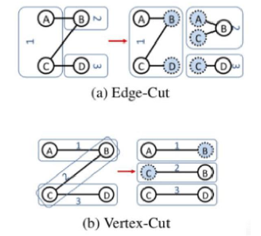
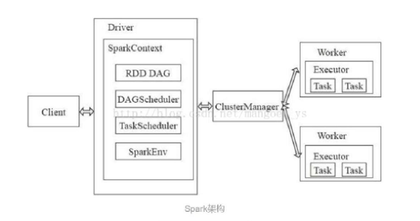
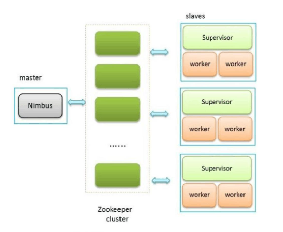
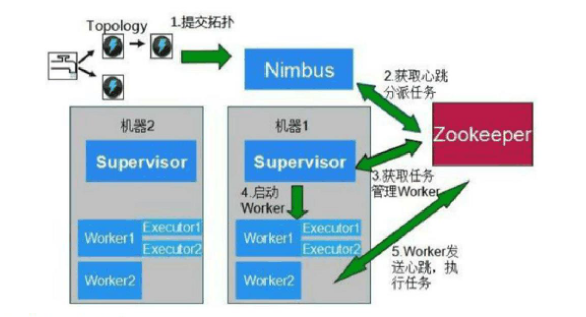
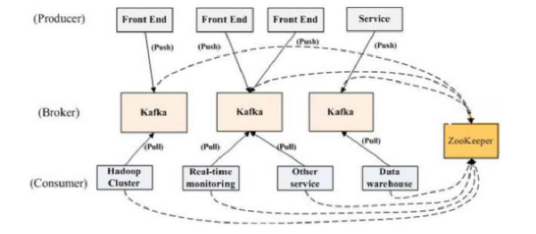
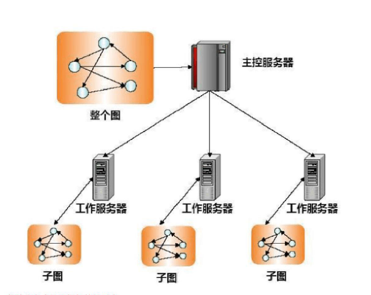

# 云计算部分

[Here](./云计算考试内容.pdf)

1. Openstack都包含那些核心项目，作用：
	Nova（计算），swift（对象存储），glance（镜像服务），keystone（身份服务），horizon（UI界面），
	Neutron（网络和地址服务），cinder（块存储）
2. Nova有哪些核心模块，工作过程是什么：
	核心模块：
	Nova-compute（虚拟机实例创建终止迁移，接受请求，执行并更新数据库状态）
	Nova-volume（映射到实例的卷的创建附加取消）
	Nova-network（接受网络任务，控制虚拟机网络）
	Nova-scheduler（调度，决定哪台机器启动新的虚拟机实例）
	Queue（守护进程传递消息）
	SQLdatabase（存储数据）
	工作过程：
	用户输入命令，api会查看这种类型的instance是否达到最大值，给scheduler发送一个消息（实际上是发送到了Queue中）
	去运行这个实例。
	调度器接受到了消息队列Queue中API发来的消息，然后根据事先设定好的调度规则，选择好一个host，之后，这个instance会在
	这个host上创建。
	真正创建instance是由compute完成的，通过glance查看镜像。
	根据找到的镜像，到database中查找相应的数据。
	volume创建虚拟机实例的卷。
	network为虚拟机分配IP等网络资源。
3. Keystone权限控制过程是什么：
	用户传credentials给Keystone进行请求，keystone进行认证以后分配给用户一个token（令牌）
	用户获得权限，将令牌和虚拟机请求传给Nova，Nova想keystone验证令牌，获得权限后连同对镜像的请求传给
	glance，glance向keystone验证令牌，把镜像传给Nova，Nova再将用户接入网络的请求传给quantum，验证成功后，即传出成功访问的回答。
4. Swift的组件有哪些，都有什么作用：
	Proxy Server：是提供swift API的服务器进程，负责swift其余组件间的相互通信。对于每个客户端的请求，它将在Ring中查询Account、Container或Object的位置，并且相应地转发请求。
	Storage Server：提供了磁盘设备上的存储服务
	Consistency Servers：查找并解决由数据损坏和硬件故障引起的错误
	Ring：Swift最重要的组件，用于记录存储对象与物理位置间的映射关系。
5. 并行化思想：将一道指令划分为几部分，然后它们可以并发地执行。各部分的指令分别在不同的CPU上运行，这些CPU可以在单台或多台机器中，它们连接起来共同运作。
6. 前序节点可以起到限流、过滤、变换等功能。

	广播节点实际上起到了数据复制的作用，使得同一份数据进入不同的管道。
	同步节点实际上起到了数据开关的作用，控制管道开关。
	
7. 图的切分方式：
	边切分，点切分。（如何切，看P11）
8. BSP计算模式：
	将计算分为一系列的超步的迭代。纵向上看是一个串行的模式，一轮一轮顺序化串行。横向上看是一个并行的模式。每两个超步间设置一个栅栏作为整体同步点。确定所有并行的计算都完成后再启动下一轮超步。
9. Swift的核心概念：
	Object：对象。基本的存储实体，所有数据按照对象进行存储。
	container：容器。对象的装载体，组织数据的方式，存储的隔间，类似于文件夹，但是不能嵌套。
	account：账户。权限单位，一个account拥有若干的container
10. 流式计算和批量计算的区别：
	批量计算：离线计算、存在时延；先将数据保存起来，然后处理；用户驱动计算请求；拉式获取计算结果。
	流式计算：实时计算、时延较小；来一个处理一个；数据驱动计算请求；推式获取计算结果。
11. 图的切分方式：
	边切分，点切分：
	
	

12.	几种架构：

	1) Spark：
		
		master-slave模型，master是集群中含有master进程的节点，slave是集群中含有worker进程的节点
		master：集群的控制器，负责整个集群的正常运行
		worker：计算节点，接受主节点命令与状态汇报
		executor：负责任务的执行
		client：作为用户的客户端负责提交应用
		driver：负责控制一个应用的执行
		
		运行流程：
		
		

	2) Storm:
		
		分布式流处理 && 实时的计算系统
		同样采用master-slave体系结构，分布式计算由nimbus（主节点）和supervisor（工作节点）两类服务进程实现。nimbus和supervisor之间的协调通过zookeeper集群实现。
		Storm中运行的一个应用是一个拓扑，对应Hadoop里的job。
		
		运行流程：
		
		
		
		
	3) Kafka:
	
		消息发布机制：
			Producer指定发布的topic
			topic里的信息物理上分为多个partition存储。Broker存储若干topic的partition，允许同topic的不同partition存储在不同的broker上，有zookeeper统一管理。
			Producer可以通过指定消息的key控制将消息发到某个partition
		消息消费机制：
			Consumer需要指定消费的topic
			Consumer需要指定隶属的consumer group
			一个topic里的每条消息只能被用一个consumer group中的一个consumer消费，属于不同的group的consumer可以共同消费同一个topic的相同消息。
			consumer group里的consumer和topic的partition按照id顺序进行消费。
		
		运行流程：
		
		
		
	4) Pregel:
	
		采用了“主从结构”，其中一台服务器充当“主控服务器”，负责整个图结构的任务切分，采用“边切法”，将其切割成子图，并且把任务分配给众多的“工作服务器”，“主控服务器”命令“工作服务器”进行每一个超级步的计算，并进行障碍点的同步和收集计算结果。“主控服务器”只负责系统管理工作，不负责具体的图计算。“工作服务器”依次对活跃节点调用F（vertex）函数，当所有的活跃节点运算完毕，“工作服务器”通知“主控服务器”本轮计算结束后的剩余活跃节点数，知道所有的图节点都处于非活跃状态为止，计算到此结束。
		
		运算流程：
		
		